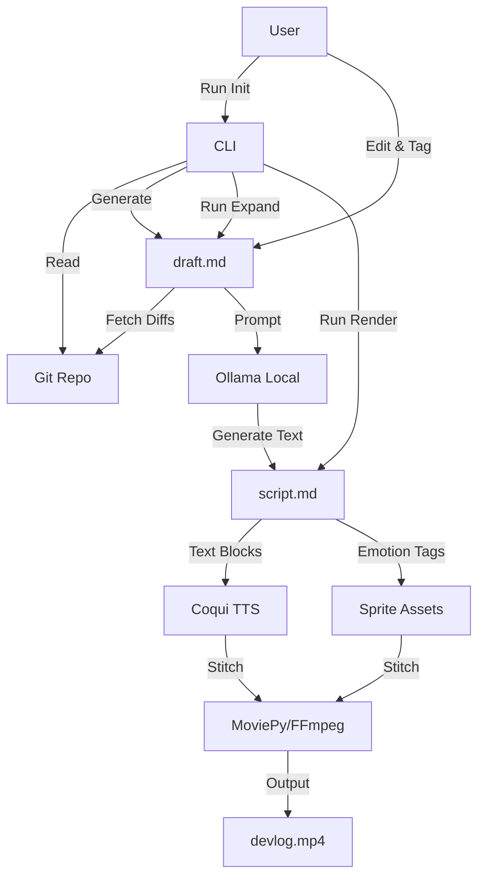

# Design: Local Dev Log Generator

## 1. Overview
A local, CLI-based tool that automates the creation of video dev logs from git history. It uses a human-in-the-loop workflow where the user selects commits, expands on technical details using an LLM, and auto-generates a video with a speaking avatar.

## 2. User Stories
* **As a dev**, I want to scan my git history to generate a summary of my recent work.
* **As a content creator**, I want to expand specific technical points into detailed explanations without writing the script from scratch.
* **As a user**, I want to generate a video with an animated avatar and voiceover running locally to avoid cloud costs and privacy issues.

## 3. Architecture

### 3.1 Workflow (State Machine)
The system moves through 3 phases, controlled by CLI commands:
1.  **Init (Drafting):** `git log` -> User Selection -> Ollama -> `draft.md`
2.  **Expand (Refining):** User adds `{{EXPAND}}` tags to `draft.md` -> Tool fetches Diffs -> Ollama -> `script.md`
3.  **Render (Production):** `script.md` -> Coqui TTS + MoviePy -> `video.mp4`

### 3.2 Component Diagram


## 4. Data Structures

### 4.1 Draft Format (`draft.md`)

Intermediate file for user review.

```markdown
---
project: "Project Name"
# ... config options
---
## Updates
* Feature A summary
{{EXPAND}} * Feature B summary (User wants deep dive here)

```

### 4.2 Script Format (`script.md`)

Final screenplay for the renderer.

```markdown
(emotion: happy)
Hey everyone! Feature A is finally done.

(emotion: thinking)
But Feature B was tricky. We had to rewrite the allocator...

```

## 5. Technical Stack

* **Core:** Python 3.10+
* **CLI:** `typer` + `questionary` (for interactive commit selection)
* **LLM:** `ollama` (via `langchain` or raw API)
* **Audio:** `coqui-tts`
* **Video:** `moviepy`
* **VCS:** `GitPython`

## 6. Implementation Stages

1. **Scaffolding:** Project structure, CLI entry point, config loader.
2. **Phase 1 (Init):** Git scanning, interactive selector, Ollama summarization.
3. **Phase 2 (Expand):** Markdown parser, Diff fetcher, "Deep Dive" prompt engineering.
4. **Phase 3 (Render):** TTS pipeline, Sprite logic, Video stitching.
